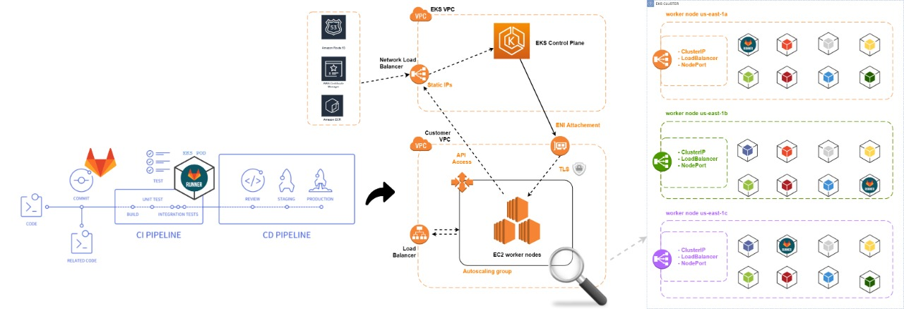

## Gitlab Day - DevOps Bootcamp by Estabilis.


## O que preciso precisa para acompanhar este LAB?

- Conta no [gitlab.com](https://gitlab.com "gitlab.com");
- Conta [AWS](https://console.aws.amazon.com "AWS") com permissoes administrativas;
- Um dominio hospedado no Route53 [Hosted Zone](https://docs.aws.amazon.com/pt_br/Route53/latest/DeveloperGuide/hosted-zones-working-with.html "Hosted Zone");
- Um cluster de Kubernetes como serviço (EKS) para este lab;
  1. Create new cluster on Amazon EKS [link](https://gitlab.com/groups/devops-heroes/bootcamp/-/clusters/new?provider=aws#create-cluster-pane "link")
  - Você deve conceder acesso aos recursos da AWS da sua organização para criar um novo cluster EKS utilizando o Gitlab. Para conceder acesso, crie uma função de provisionamento usando a conta e o ID externo e forneça o ARN [documentação](https://console.aws.amazon.com/iam/home?#roles "documentação").
  2. Connect existing cluster [link](https://gitlab.com/groups/devops-heroes/bootcamp/-/clusters/new?provider=aws#add-cluster-pane "link")
  - Insira as informações de acesso para seu cluster Kubernetes. Se precisar de ajuda, você pode ler a [documentação](https://gitlab.com/help/user/project/clusters/add_remove_clusters#add-existing-cluster "documentação") sobre kubernetes.
- aws cli instalado [documentação](https://docs.aws.amazon.com/pt_br/cli/latest/userguide/cli-chap-install.html "documentação");
- aws cli configurado [documentação](https://docs.aws.amazon.com/pt_br/cli/latest/userguide/cli-configure-quickstart.html "documentação");
- kubectl instalado [documentação](https://docs.aws.amazon.com/pt_br/eks/latest/userguide/install-kubectl.html "documentação").

## Quais variaveis não posso me esquecer de configurar?
*Criando Variables no projeto: [documentação](https://docs.gitlab.com/ee/ci/variables/README.html "documentação").*

- `REGISTRY_USER` = Contendo nome de Usuario `Deploy token` criado [documentação](https://docs.gitlab.com/ee/user/project/deploy_tokens/ "documentação").
- `REGISTRY_TOKEN` = Contendo token de usuario criado.
- `HOSTED_ZONE_ID` = ID da zona que o dominio esta configurado [documentação](https://docs.aws.amazon.com/pt_br/Route53/latest/DeveloperGuide/ListInfoOnHostedZone.html "documentação").
- `AWS_ACCESS_KEY_ID` = Contendo o ID do usuario `IAM` com policy de gerencia do `Route53`.
- `AWS_SECRET_ACCESS_KEY` = Contendo a Secret key do usuario IAM.

# Estrutura proposta



# how-to prepare infrastructure
*Tendo em vista que nosso cluster `EKS` ja esteja disponivel para o Gitlab precisamos:*

- Clonar repositorio `gitlab-day`

```
$ git clone https://gitlab.com/devops-heroes/bootcamp/gitlab-day.git
```

- Solicitar certificado wildcard para dominio `*.exemplo.com.br` hospedado. [documentação](https://docs.aws.amazon.com/pt_br/acm/latest/userguide/gs-acm-request-public.html "documentação").

- Coletar `ARN` do certificado gerado para o dominio *.exemplo.com.br

- Instalar `Ingress Controller` nginx no cluster `EKS`, o mesmo arquivo pode ser encontrado em [ingress-nginx-deploy](https://kubernetes.github.io/ingress-nginx/deploy/ "ingress-nginx-deploy") 
*Necessario realizar duas alteracoes no arquivo antes de realizar o deployment*

1. Alterar `service.beta.kubernetes.io/aws-load-balancer-ssl-cert` adicionando ARN de certificado. linha: 286 `Obrigatorio`;
2. Alterar `proxy-real-ip-cidr` da `VPC` do cluster. linha:43 `Obrigatorio`;
3. Alterar tags do o LB `service.beta.kubernetes.io/aws-load-balancer-additional-resource-tags` para melhor identificar no `Billing`. linha: 287 `Opcional`.

```
$ kubectl apply -f aws/deploy.tls.termination.yaml
```

- Aplicar service account e cluster role binding no seu cluster `EKS/K8S`:
```
$ kubectl apply -f aws/gitlab.ClusterRoleBinding.yaml
```

- Instalar `Gitlab-runner`
- instalar `Prometheus`
